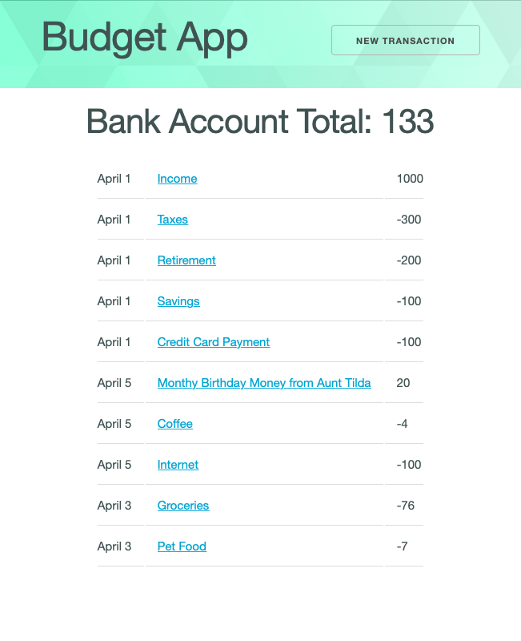
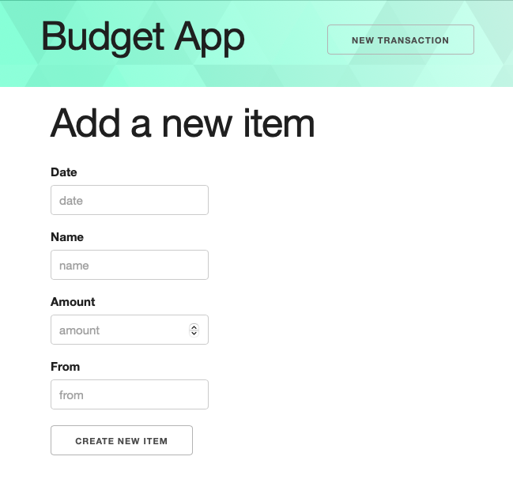

# Full Stack Budgeting App

Create a backend API using Express that performs full CRUD on a single model, `transactions`. Then, using RESTful routes, connect it to a React app.

## Overview

- Use Express to build a back-end.
- Use `create-react-app` to build a front-end.
- Connect the back-end and the front-end.
- Deploy both apps so anyone can see them online.

## User Stories, Acceptance Criteria and Code Quality Rubric

You must implement all of the user stories and acceptance criteria below. After those are completed, look at and implement as many of the bonus features as you want to.

Be sure to build this out as a portfolio piece: Something you would be excited to show to a potential employer and be able to talk through the code with them. 

### User Stories

You must successfully build a minimum of 6 out of 9 features to pass this project

#### (1) Navigation/Nav Bar

- The Nav bar allows me to navigate to the Index and New pages

#### (2) Index Page

- I can see a list of income and expenditures with the date, the transaction name and the amount on the Index page.

- There is also an Account total visible that sums all the different expenditures and shows the user how much money they currently have.

#### (3) New Page

- I can click on a "New" button that takes me to the New page, with a form that lets me create a new transaction.

- Once a transaction is created, I am navigated back to the Index page

#### (4) Show Page

- I can see a single expenditure with more details and appropriate navigation links

#### (5) Edit page 

- I can see a form that is pre-filled with an individual expenditure that allows me to update the expenditure. Once updated, I am taken back to the show page where I should be able to see the updated transaction, without needing to refresh the page.

- The edit form is accessible either from the Show page or Index page via button/link.

#### (6) Delete functionality

- The expenditure can be deleted. 

- The delete functionality is accessible either from the Show page or Index page via button/link.

#### (7) Account Total

 - The account total is visible either on the Index page (this is more straightforward) or in the Nav Bar (this is more challenging). 

- The account CSS changes depending on the amount. The account should show green (or similar color) if the amount is above $1000. There should be neutral/white color between $0 - $1000. And it should show a red (or similar color) if the bank account value falls below $0. 

- The changing color can be text, background, border, as long as it is in/near the account total and provides clarity with what it is showing.

#### (8) UX/UI
- There is effort to make the app styled. Forms are styled and properly labeled. The navigation is clear and easy to use, a color theme has been chosen and applied. At least one font has been chosen and applied. The app is responsive (readable/usable) across multiple screen sizes/widths.

#### (9) Deployed online

- I can visit the application via the internet

- Netlify is configured correctly that I can send a link to the New page to someone and it works (does not give a 404)

#### Bonus Feature

- There is implementation of at least one bonus feature beyond what has been taught in class/required in lab/required in the rest of the criteria. 

- This can be a CSS framework, a new NPM package, a chart that shows the data in a new way, working with the date object instead of strings etc. Please confirm with your instructor.

### Acceptance Criteria

#### Back-end

For the back-end to be complete, the following must be true:

- The application uses `express`, `dotenv`, `cors`.
- The application is [deployed](https://github.com/joinpursuit/step-by-step-guides) and can be accessed from your React front-end app and Postman.
- The application has the following routes and work as described below.
- The application handles common errors and has any necessary validations

|  #  | Action  |        URL        | HTTP Verb |    CRUD    |                  Description                   |
| :-: | :-----: | :---------------: | :-------: | :--------: | :--------------------------------------------: |
|  1  |  Index  |   /transactions   |    GET    |  **R**ead  |   Get a list (or index) of all transactions    |
|  2  |  Show   | /transactions/:id |    GET    |  **R**ead  | Get an individual view (show one transactions) |
|  3  | Create  |   /transactions   |   POST    | **C**reate |           Create a new transactions            |
|  4  | Destroy | /transactions/:id |  DELETE   | **D**elete |             Delete a transactions              |
|  5  | Update  | /transactions/:id |    PUT    | **U**pdate |             Update a transactions              |

> **Note:** All of the above routes should work both with an application like Postman and a front-end framework like React

**Model**

- There will be one model with at least these components
 - `item_name`- string - the name of the transaction (ie: income, savings, cat food, etc.)
 - `amount`  -number - the amount of the transaction
 - `date`- string - the date should be a simple string. As a bonus activity, use the date object and date input field and format it to be human-readable
 - `from` - string - who this transacton was with (ie. employer, bank, pet store, grocery store, etc)
 - `category` - string - what category does this fall into (income, savings, pets, food, etc) - bonus, make this an options list on the new/edit forms. 

#### Front-End

For the front-end to be complete, the following must be true:

1. The application is deployed.
1. The navigation bar allows the user to switch between the "Index" and "New" pages. Bonus: shows amount total. 
1. The following is present on the "Index" page:

   - The navigation bar.
   - A list of transactions that have the following properties visible:
     - `date` - a string, in any format.
     - `name` - a string, representing the name of the transactions.
     - `amount` - a number, representing the amount of the expenditure/income.
     - The bank account total somewhere near the top.
     - The bank account CSS changes depending on the amount in the bank account

1. The following is present on the "New" page:
   - The navigation bar.
   - The url will be `/transactions/new`.
   - The form to create new transactions, which has four fields.
     - `date` - a string, in any format.
     - `name` - a string, the name of the transactions.
     - `amount` - a number, the amount of the expenditure/income.
     - `from` - a string, where this expense/income has come from.
     - `category` - a string. As a bonus, this can be an options menu. 
  
1. The following is present on the "Show" page
     - `date` - a string, in any format.
     - `name` - a string, the name of the transactions.
     - `amount` - a number, the amount of the expenditure/income.
     - `from` - a string, where this expense/income has come from.
     - `category` - a string`

1. The following is present on the "Edit" page
   - The navigation bar.
   - The url will be `/transactions/new`.
   - The form to create new transactions, which has four fields.
     - `date` - a string, in any format.
     - `name` - a string, the name of the transactions.
     - `amount` - a number, the amount of the expenditure/income.
     - `from` - a string, where this expense/income has come from.
     - `category` - a string. As a bonus, this can be an options menu. 
  

## Deployment

- [Netlify Deployment for create-react-app](./netlify-cra.md)

- [Netlify Set Up Continuous Deployment](https://github.com/joinpursuit/Netlify-CRA-Cont-Deploy-Guide)

- [Deploy Express App](https://github.com/joinpursuit/step-by-step-guides)

## Bonus Ideas:

- Change favicon from default react app.
- Add some logic/functionality that will make income a positive number and an expenditure a negative number, rather than having the user type it in.
- Use [react-bootstrap](https://react-bootstrap.github.io) or similar, to help style your app.
- Show the amount in the nav bar, so it is visible on every view.
- Use the date object for the date, instead of just a string.
- Use the input type `date` for the date.
- Add a library like [chartjs](https://www.chartjs.org) or [D3](https://www.chartjs.org) to provide visualizations the budget app.

Be sure to confirm with your instructor which bonus idea you will implement.
